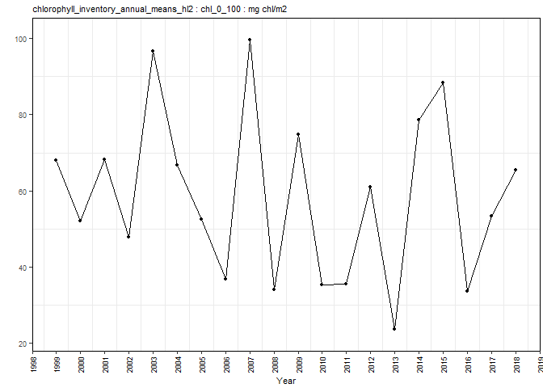
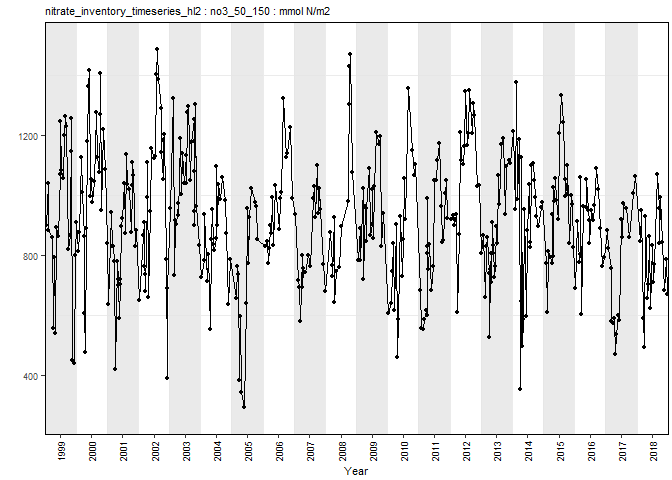

azmpdata R package
================
Benoit Casault
05 May, 2020

<!-- README.md is generated from README.Rmd. Please edit that file -->

# *azmpdata*

<!-- badges: start -->

<!-- badges: end -->

The R package *azmpdata* provides a series of data products derived from
raw data collected as part of the Atlantic Zone Monitoring Program
([AZMP](https://www.dfo-mpo.gc.ca/science/data-donnees/azmp-pmza/index-eng.html)).
The data products provided in this package are used to generate the
different figures contained in the Research Documents produced annually
by Fisheries and Ocean Canada’s Maritimes region. The Research Documents
describe the physical, chemical and biological conditions observed in
Maritimes region since the inception of the AZMP program (see example
documents for the
[physical](http://www.dfo-mpo.gc.ca/csas-sccs/Publications/ResDocs-DocRech/2018/2018_016-eng.html)
conditions and for the [optical, chemical and
biological](http://www.dfo-mpo.gc.ca/csas-sccs/Publications/ResDocs-DocRech/2018/2018_017-eng.html)
conditions).

## Package Installation

The *azmpdata* R package can be installed from
[GitHub](https://github.com) with:

``` r
# install.packages("devtools")
devtools::install_github("casaultb/azmpdata")
```

## Datasets

The *azmpdata* package provides three categories of data products:
physical, chemical and biological variables, which are summarized below.
Each data product is provided as a *data frame* or as a *csv* file.

To access a dataset in data frame format:

``` r
library(azmpdata)
head(chlorophyll_inventory_annual_means_hl2)
#>   year chl_0_100
#> 1 1999  67.95402
#> 2 2000  52.10942
#> 3 2001  68.24642
#> 4 2002  47.73511
#> 5 2003  96.57796
#> 6 2004  66.61414
```

To access a dataset in csv format:

``` r
system.file("extdata", "chlorophyll_inventory_annual_means_hl2.csv", package = "azmpdata")
#> [1] "C:/Users/Benoi/Documents/R/win-library/3.6/azmpdata/extdata/chlorophyll_inventory_annual_means_hl2.csv"
```

#### Physical Data Products

Table to come here. <!-- ``` r --> <!-- library(tibble) -->
<!-- library(knitr) --> <!-- ``` -->

#### Chemical Data Products

| Dataset                             | Description                                          | Variables                |
| :---------------------------------- | :--------------------------------------------------- | :----------------------- |
| nitrate\_inventory\_timeseries\_hl2 | Timeseries of nitrate inventory at Halifax-2 station | no3\_0\_50; no3\_50\_150 |

#### Biological Data Products

| Dataset                                    | Description                                                | Variables   |
| :----------------------------------------- | :--------------------------------------------------------- | :---------- |
| chlorophyll\_inventory\_timeseries\_hl2    | Timeseries of chlorophyll inventory at Halifax-2 station   | chl\_0\_100 |
| chlorophyll\_inventory\_annual\_means\_hl2 | Annual means of chlorophyll inventory at Halifax-2 station | chl\_0\_100 |

## Package Functionality

Although the main goal of *azmpdata* is to provide easy access to a
variety of data products, the package also supports a few basic
functions for which examples are shown below.

#### Dataset Documentation

A detailed description of the whole package is available using the
following command:

``` r
library(azmpdata)
help("azmpdata")
```

In addition, each dataset is documented and the following command
returns a detailed description about a given dataset:

``` r
library(azmpdata)
help("chlorophyll_inventory_timeseries_hl2")
```

#### Keyword Search

The function *search\_azmpdata* allows to look up which datasets match a
certain keyword criterion. For example, the following command returns
all the datasets containing *chlorophyll* data:

``` r
library(azmpdata)
search_azmpdata("chlorophyll")
#> [1] "chlorophyll_inventory_annual_means_hl2"
#> [2] "chlorophyll_inventory_timeseries_hl2"
```

#### Plotting

The function *plot\_azmpdata* is a wrapper that allows to plot a given
variable in a dataset. Plot format differs according to the type of
dataset (e.g. timeseries or annual means). For example, the following
command displays a plot of the *chl\_0\_100* variable from the
*chlorophyll\_inventory\_annual\_means\_hl2* dataset:

``` r
library(azmpdata)
plot_azmpdata("chlorophyll_inventory_annual_means_hl2", "chl_0_100")
```

<!-- -->

Aother example, the following command displays a plot of the
*no3\_50\_150* variable from the *nitrate\_inventory\_timeseries\_hl2*
dataset:

``` r
library(azmpdata)
plot_azmpdata("nitrate_inventory_timeseries_hl2", "no3_50_150")
```

<!-- -->
