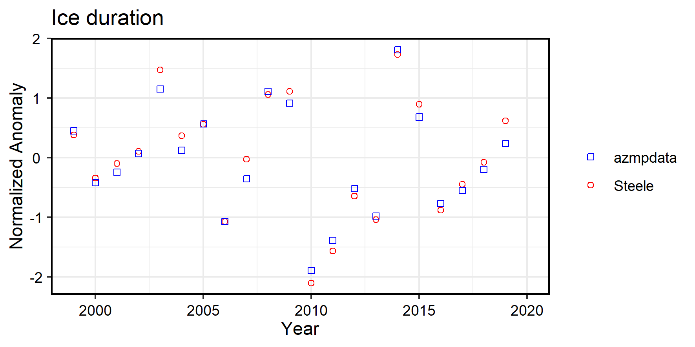
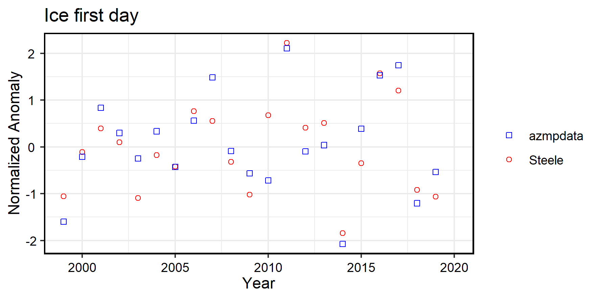
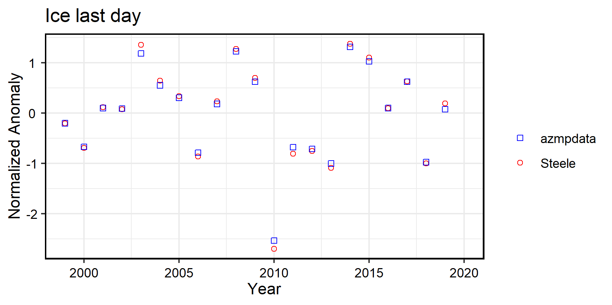

```{r setup, include=FALSE}
knitr::opts_chunk$set(message=F, warning=F)
```

# Preamble

Ice timing metrics are used as environmental variables in the multivariate analysis of Maritimes ecological data. Metrics of particular interest are the first and last day, and the duration of ice occurrence in a given region (i.e. combined Gulf of St. Lawrence and Scotian Shelf). These metrics are derived from ice maps with a spatial resolution of ~1 km. For the combined GSL+SS area, this represents ~250000 grid points.

In a previous study, these metrics were provided as anomalies which were calculated as follows:

1. Calculate climatological means at each grid point of the domain.

2. Calculate annual anomalies at each grid point as the difference between the annual value minus the climatological mean.

3. Calculate the domain-wide mean annual anomaly as the average of the annual anomaly values over the domain.

4. Calculate normalized domain-wide annual anomalies using 1999-2015 period as reference.

The newly developed R package *azmpdata* provides a central source of data which are expressed in absolute units as opposed to anomalies. Therefore, metrics such as the first and last day of ice occurrence are expressed as the day number relative to January 1st of a given year (a negative value indicates ice occurring prior to January 1st), and the duration of ice is expressed in number of days. In this case, and for the purpose of comparison, the annual means and annual anomalies based on data from the *azmpdata* package are calculated as follows:

1. Calculate the domain-wide annual means as the average of each metrics values over the domain in a given year.

2. Calculate the domain-wide climatological means and standard deviation over the 1999-2015 reference period.

3. Calculate the normalized domain-wide annual anomalies as the difference between the annual means minus the climatological mean and divided by the climatological standard deviation.

The two methods basically differ in the domain-wide averaging whereas metrics values in absolute units are averaged in *azmpdata* as opposed to averaging anomalies as was done in the previous study. This note is to compare the two methods of calculating the different metrics in terms of their resulting anomalies.

# Results

\  

\  

\  

\  

# Comments

* There is a generally good agreement between the two methods of calculation of the anomalies for each metrics.

* The biggest differences are observed for the first day of ice occurrence for the years 2003, 2007, 2010 and 2015.

* Also for the first day of ice occurrence, the interannual pattern (i.e. direction of the change between consecutive years) between the two anomalies is opposite for the years 2006-07, 2009-10, 2016-17 and 2018-19.
