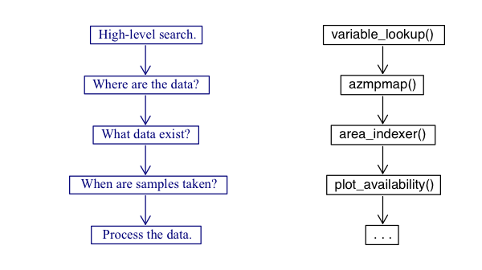

```{r, eval=FALSE}
library(azmpdata)
```

```{r, echo=FALSE, warning=FALSE, error=FALSE, message=FALSE}
library(azmpdata)
```

## Introduction

This vignette will describe how to effectively analyze, both spatially and temporally, the data contained within the `azmpdata` package. To do so, basic R functions combined with built-in functions, `variable_lookup()`, `azmpmap()`, `area_indexer()`, and `plot_availability()` will be explained. A suggested work flow is shown below to help the user navigate the package.




## Searching the data

### Basic R functions

Listing all the available dataframes in a package can be a quick way to see a high level overview of the datasets. The output from the following code will display all the dataframe names as well as brief, high-level descriptions. This data will appear in a new window.

```{r, eval=FALSE}

data(package = 'azmpdata')

```

You can browse through the help documentation for all datasets, and functions in the package by calling the code below. This information will come up in the R studio help window. 

```{r, eval=FALSE}

help(package = 'azmpdata')

```

Clicking on a specific dataframe name or function in the help window will bring you to a detailed help page. For dataframes, this help page will include variable names and definitions, as well as information about the source of the data and the proper citation.

R studio provides some built in capability to be able to search through the help files for a given package. The function `help.search()` can be used to search through titles and descriptions of help files in a package. 

```{r, eval=FALSE}

help.search(pattern = 'section', package = 'azmpdata')

```

This code will bring up all the help files (in the R studio help window), which match the `pattern` provided. Note, that this does not search through the __entire text__ of the help file, for more details see `lookup_variable()` in the next section.


### variable_lookup()

This is the first step in the suggested work flow for the `azmpdata` package. We have created a custom search function in `azmpdata` which allows a user to search the package in two ways. One, search for keywords in the names of all variables, included in all datasets of the package. Two, search for keywords in the entirety of the package help text (including the `details` sections, which often contains variable definitions and is not searched through when using `help.search()`).

The output of this function will be a table with three columns, `keyword`, or the search keyword that was provided, that has been matched (this is useful if providing multiple keywords), `variable`, the name of the variable which matched your keyword search, and `dataframe` which will be the name of the dataframe in which your matched variable is contained, or if searching through the help text, the name of the dataframe where your keyword was found in the help text. 

This function can be provided with a single keyword,

```{r}
variable_lookup('nitrate')
```

or multiple keywords.

```{r}
variable_lookup(c('nitrate', 'integrated'))
```

In order to search through the help text, use the option `search_help`

```{r}
variable_lookup('nitrate', search_help = TRUE)
```

Note, that if the search returns a match to your keyword in the text of a help file, the output will not return a specific variable name in the `variable` column (instead it will return NA), and will give you only the dataframe name in the `dataframe` column. 


### R functions and variable_lookup combined

Once you have your search results, you may want to call the dataframe which matched your search terms. This is very straight-forward if using our custom search function `variable_lookup()`

```{r, eval=FALSE}
ans <- variable_lookup(keywords = 'wet weight', search_help = TRUE)

df <- get(ans$dataframe[1])

```


## Spatially displaying data: azmpmap()

Once the user has a general idea of what is contained within the package using `variable_lookup()`, the next logical step, step 2 of the workflow, is to locate where the samples are taken. To do so, we have created the `azmpmap()` function. This function generates a leaflet plot of the geospatial files. The user then has the option to focus in on different stations, sections, and areas with the ability to double-click to see the name, depth, and associated dataframes. To try out `azmpmap()` use the following code:


```{r, message=FALSE, warning=FALSE, error=FALSE, eval=FALSE}
azmpmap()
```


### area_indexer()

At this point the user knows generally what is contained within the package from `variable_lookup()` as well as where data are sampled using `azmpmap()`. It is then recommended that the user utilize the information provided in the popups to dive deeper into their search, using `area_indexer()` or step three of the workflow.`area_indexer()` assembles a dataframe consisting of the years and areas where the azmpdata packages data has been collected, as well as the associated file where the data can be found. The user also has the ability to look at associated parameters and months with the specification.

For example, if a user was interested in the nitrate in station P5 from years 2010 to 2020, the following code would be used:

```{r, warning=FALSE, message=FALSE, error=FALSE, eval=TRUE}
k <- area_indexer(parameters="nitrate", areanames="P5", years=c(2010:2020), fuzzyParameters = F)
head(k)
```

Basically, `area_indexer()` is a good way to filter through the multiple dataframes to get exactly what the user is interested in.


## Temporally displaying data: plot_availability()

The user now knows what is contained within the package, where data are sampled, and how to properly filter through the data. It is then recommended that the user completed step 4, `plot_availability()` to understand when the data are sampled. This function generates a score card of samples per month based on `areaType`, `areaName`, and `parameters`.

For example, if a user wanted to know the frequency (ie. samples/month) for the nitrate at station P5, they would type in the following:

```{r, message=FALSE, error=FALSE, warning=FALSE, eval=TRUE, fig.cap="Figure 3: Sampling freqency per month for nitrate at station P5"}
plot_availability(areaType = "station", areaName="P5", parameters="nitrate")
```

## Conclusion

The package `azmpdata` contains a wealth of datasets to help analyze AZMP data. It is recommended that the users utilize the built in functions in the following order 1) `variable_lookup()`, 2) `azmpmap()` 3) `area_indexer()`, and 4) `plot_availability()` to easily search through the data and efficiently analyze both spatially and temporally. For more information on base R search functions please feel free to do your own research. For questions about the custom `azmpdata` search please contact developers or bring an issue to the github board (listed in the package description under BugReports). 


